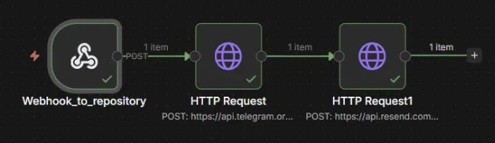

# Resend Email - Watkit API

Módulo de notificaciones por correo electrónico usando Resend y n8n.

## ¿Qué hace?

Al detectarse un nuevo push en el repositorio de Watkit API, este módulo envía automáticamente un correo electrónico de notificación al destinatario configurado, complementando el canal de alertas por Telegram.

## Tecnologías usadas

- [Resend](https://resend.com) — API de envío de correos
- [n8n](https://n8n.io) — Automatización del flujo
- Python 3.13

## Configuración

1. Instala la dependencia:
pip install resend
2. Crea una cuenta en resend.com y genera una API Key
3. Configura la variable de entorno:
RESEND_API_KEY=re_tu_key_aqui

## Flujo en n8n

1. **Webhook** — recibe el evento de push del repositorio
2. **HTTP Request** — notifica al bot de Telegram
3. **HTTP Request (Resend)** — envía correo al destinatario

## Workflow

